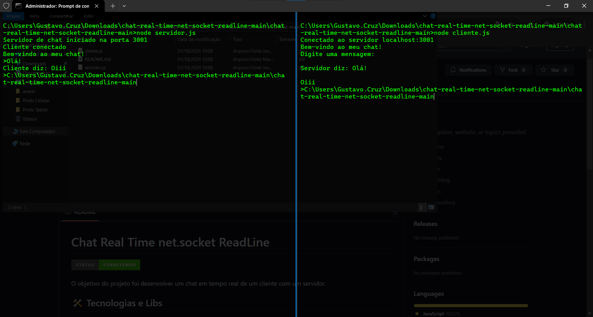

# Chat Real Time net.socket ReadLine


O objetivo do projeto foi desenvolver um chat em tempo real de um cliente com um servidor.



## 🛠 Tecnologias e Libs

As seguintes ferramentas foram usadas na construção do projeto:

* VSCode;
* JavaScript;
* Net.socket;
* ReadLine; e
* Node.JS.


## 🚀 Como executar o projeto

```bash

# Clone este repositório
$ git clone git@github.com/Gustavo-Cruz-Pinheiro/Gustavo-Cruz-Pinheiro-chat-real-time-net-socket-readline.git

# Acesse a pasta do projeto no seu terminal/cmd
$ cd chat-real-time-net-socket-readline-master

# Execute o arquivo servidor.js em um terminal e cliente.js em outro
$ node servidor.js
$ node cliente.js

# Pronto! A aplicação já está sendo executada, agora é necessário apenas digitar as mensagens e apertar "ENTER" para enviar!

```

## Autor

Gustavo Cruz Pinheiro

### Me siga nas redes sociais

<a href="https://github.com/Gustavo-Cruz-Pinheiro"></a>
<a href="https://www.instagram.com/gusttavo.cruz_"></a>
<a href="https://www.facebook.com/gustavocruzpinheiro"></a>
<a href="https://www.linkedin.com/in/gustavo-cruz-pinheiro-61b852217/"></a>
